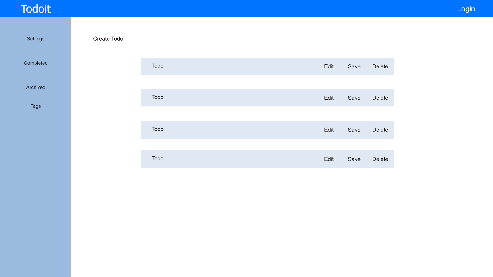

# Todoit-
Todolist application that utilizes authentication, RESTful routes, CRUD, and styling. Users will be able to log into their todo list to create, edit, and delete todos. 

# Wireframe 
Simple layout of the application

